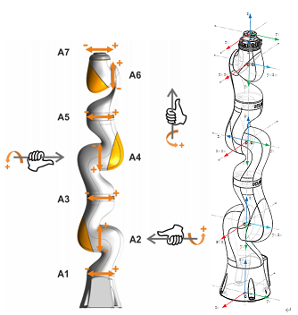

# 测试任务

## 任务1

### 测试内容：迭代次数限制，精度，步长衰减

### 输出内容：时长，迭代次数，成功率，残差值得统计

### 输出格式：csv/markdown 表格

**格式示例**：

| 记录编号 | 残差差值       | 递减率系数     | 平均迭代次数 | 总耗时/ms | 平均耗时/μs |
| -------- | -------------- | -------------- | ------------ | --------- | ----------- |
| 1        | $-1\times10^4$ | $\alpha = 0.5$ | $11.4417$    | $58918$   | $58.918$    |
| 2        | $-5\times10^4$ | $\alpha = 0.5$ | $10.9518$    | $53143$   | $53.143$    |
| 3        | $-1\times10^4$ | $\alpha = 0.5$ | $10.8519$    | $56958$   | $56.958$    |
| 4        | $-5\times10^4$ | $\alpha = 0.3$ | $10.7285$    | $55209$   | $55.209$    |
| 5        | $-1\times10^4$ | $\alpha = 0.3$ | $11.2393$    | $54035$   | $54.035$    |

| 记录编号 | 递减迭代次数       | 递减率系数     | 平均迭代次数 | 总耗时/ms | 平均耗时/μs |
| -------- | ------------------ | -------------- | ------------ | --------- | ----------- |
| 1        | $Iters_{decay}=30$ | $\alpha = 0.5$ | $12.8517$    | $64730$   | $64.73$     |
| 2        | $Iters_{decay}=20$ | $\alpha=0.5$   | $13.4127$    | $67000$   | $ 67 $      |
| 3        | $Iters_{decay}=30$ | $\alpha = 0.3$ | $13.1685$    | $74027$   | $74.027$    |
| 4        | $Iters_{decay}=20$ | $\alpha = 0.3$ | $14.4854$    | $77282$   | $77.282$    |
| 5        | $Iters_{decay}=30$ | $\alpha = 0.1$ | $14.7181$    | $82672$   | $82.672$    |
| 6        | $Iters_{decay}=20$ | $\alpha = 0.1$ | $20.0738$    | $109922$  | $109.922$   |

| 记录编号 | 递减迭代次数       | 递减率系数     | 10以内/%  | 10~20/%   | 20~30/%  | 超过30/% |
| -------- | ------------------ | -------------- | --------- | --------- | -------- | -------- |
| 1        | $Iters_{decay}=30$ | $\alpha = 0.5$ | $49.0954$ | $39.859$  | $8.1556$ | $2.89$   |
| 2        | $Iters_{decay}=20$ | $\alpha=0.5$   | $48.735$  | $40.258$  | $3.834$  | $7.173$  |
| 3        | $Iters_{decay}=30$ | $\alpha = 0.3$ | $48.9813$ | $39.9479$ | $8.1777$ | $2.8931$ |
| 4        | $Iters_{decay}=20$ | $\alpha = 0.3$ | $48.9556$ | $39.9965$ | $3.2365$ | $7.8114$ |
| 5        | $Iters_{decay}=30$ | $\alpha = 0.1$ | $49.0462$ | $39.8792$ | $8.1499$ | $2.9247$ |
| 6        | $Iters_{decay}=20$ | $\alpha = 0.1$ | $48.9605$ | $39.9651$ | $2.865$  | $8.2093$ |

**旋量轴示例**：



**Scruw Axes in Base Frame:**

|  标号 |    $$q_i$$     | $$\omega_i$$ |     $$v_i$$     |
| ----: | :------------: | :----------: | :-------------: |
| **1** |  $$(0,0,0)$$   | $$(0,0,1)$$  |   $$(0,0,0)$$   |
| **2** | $$(0,0,360)$$  | $$(0,1,0)$$  | $$(-360,0,0)$$  |
| **3** |  $$(0,0,0)$$   | $$(0,0,1)$$  |   $$(0,0,0)$$   |
| **4** | $$(0,0,780)$$  | $$(0,-1,0)$$ |  $$(780,0,0)$$  |
| **5** |  $$(0,0,0)$$   | $$(0,0,1)$$  |   $$(0,0,0)$$   |
| **6** | $$(0,0,1180)$$ | $$(0,1,0)$$  | $$(-1180,0,0)$$ |
| **7** |  $$(0,0,0)$$   | $$(0,0,1)$$  |   $$(0,0,0)$$   |

**DH 转旋量轴示意：**

```cpp
// params 为 n x 4 的参数
// const vector<vector<float>>& params

LocalTransformsSE3<float> matrices = LocalTransformsSE3<float>::fromMDH(params);

auto [twists, T] = matrices.toTwists();	

// from mDH
template<class _Scaler>
LocalTransformsSE3<_Scaler> LocalTransformsSE3<_Scaler>::fromMDH(const vector<vector<_Scaler>>& mdh_params)
{
	assert(mdh_params[0].size() == 4);
	LocalTransformsSE3<_Scaler> SE3s;	
	vector<SE3<_Scaler>> & transform_matrices = SE3s.matrices_;
	transform_matrices.resize(mdh_params.size());
	for (int idx = 0; idx < mdh_params.size(); ++idx) 
	{
		const vector<_Scaler>& param = mdh_params[idx];
		transform_matrices[idx] = RobotKinematic::ModifiedDH(param[0], param[1], param[2], param[3]);
	}
	return SE3s;
}

// to Twist
template<class _Scaler>
pair<vector<Twist<_Scaler>>, SE3<_Scaler>> LocalTransformsSE3<_Scaler>::toTwists()
{
	vector<Twist<_Scaler>> twists(matrices_.size());
	SE3<_Scaler> transform_matrix;
	transform_matrix.setIdentity();
	for (int idx = 0; idx < matrices_.size(); ++idx) {
		transform_matrix = transform_matrix * matrices_[idx];
		auto [R, p] = RtDecompositionMat4(transform_matrix);
		Vector<_Scaler, 3> w = R * Vector<_Scaler, 3>::UnitZ();
		twists[idx] = ScrewToTwist(p, w);	
	}
	return { twists, transform_matrix };
}
```

**代码示例**：

```cpp
const float Precesion = 1e-4f;
/* 该部分轴数以及布置位型需要调整 */
vector<Twist<float>> expcoords(7);
for (auto& twist : expcoords) twist = Twist<float>::Random();


SE3<float> M, G;
M.setIdentity();
M.block(0, 0, 3, 3) = Roderigues((Vector<float, 3>::Random() * 3.1415926535f).eval());
M.block(0, 3, 3, 1) = Vector<float, 3>::Random() * 250.0f;

// 实际测试段计时部分，需改变得是 G 以及 后缀三个参数，expcoords 可使用自定义机械臂
DynVec<float> thetas = 2.0f * 3.1415926535f * Vector<float, 7>::Random() - 3.1415926535f * Vector<float, 7>::Ones();
RobotKinematic::ForwardKinematic(G, M, expcoords, thetas);

DynVec<float>	out_thetas;		
RobotKinematic::InverseKinematic(out_thetas, M, expcoords, G, Vector<float, 7>::Zero(), DynamicLeastNormSolver<float>{}, Precesion/*, MaxIteration , Scaler*/);
// 实际测试段计时结束

// 结果输出对比部分
SE3<float> T;
RobotKinematic::ForwardKinematic(T, M, expcoords, out_thetas);
bool result = (LogMapSE3Tose3((G * InverseSE3(T)).eval())).norm() < Precesion;
```

